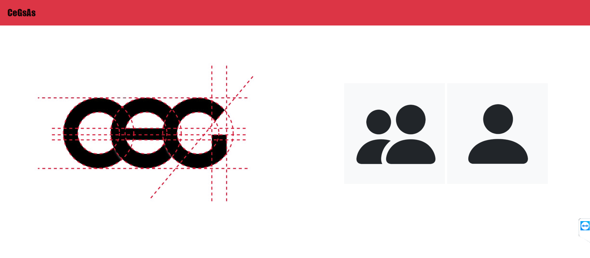

# CEGSAS - CEG Smart Attendance System
A **Smart Student Attendance Management System** through which faculties can mark and maintain attendance records of students and students can view their attendance percentage.

Developed using SQL Plus to manage the database, Flask as the back-end framework, jQuery, Ajax, Bootstrap and HTML to implement the front-end.

## Funtionalities of Web app
- Faculties can view all the students who have shortage of attendance in a particular course.
- Students can view their daily attendance percentages in all their enrolled courses.
- Easy interface through which faculties can mark attendance for students.

### Homepage

### Login
| Student Login | Faculty Login |
:-------------------------:|:-------------------------:
 | 

### Welcome Page
| Student Welcome Page | Faculty Welcome Page |
:-------------------------:|:-------------------------:
 | 
### View Details
| Student Details | Faculty Details |
:-------------------------:|:-------------------------:
 | 

### Mark Attendance

### Attendance Shortage

